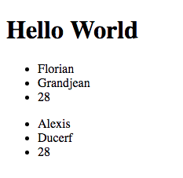

# Mise en place d'une architecture "type" en suivant le design pattern MVC - Part 1

## 1. Installation de composer via terminal en Global
```
php -r "copy('https://getcomposer.org/installer', 'composer-setup.php');"  
php -r "if (hash_file('SHA384', 'composer-setup.php') === '544e09ee996cdf60ece3804abc52599c22b1f40f4323403c44d44fdfdd586475ca9813a858088ffbc1f233e9b180f061') { echo 'Installer verified'; } else { echo 'Installer corrupt'; unlink('composer-setup.php'); } echo PHP_EOL;"  
php composer-setup.php  
php -r "unlink('composer-setup.php');"  
mv composer.phar /usr/local/bin/composer  
```
Sources: 
- https://getcomposer.org/download/
- https://getcomposer.org/doc/00-intro.md#globally

## 1. Creation de l'architecture
1. Créer un dossier public
    1. Dans le dossier public:
        1. Créer index.php
        1. Un dossier assets qui contiendra css, js, et image
1. Créer un dossier src
    1. Dans le dossier src
        1. Créer un dossier Controller
        1. Créer un dossier Views

## 2. Initialisation avec composer
1. `composer init` dans le terminal dans le dossier du projet
2. Valider tous les champs avec la conf par défault
3. A la question voulez vous charger les dépendances (prod et dev) de manière interactive, répondre **no**
4. Vérifier la saisi puis confirmer la génération


Source:
- http://www.umanit.fr/En-ce-moment/UmaNotes/Gerer-ses-dependances-PHP-avec-Composer

## 3. Initialiser l'autoload dans le composer.json
- Rajouter les lignes ci dessous au *composer.json* et remplacer **MyApp** par votre namespace global
```
    "autoload": {
    "psr-4": {
        "MyApp\\": "src/"
    }
},
```
- Mettre à jour composer
    1. Executer la commande `composer update` afin de mettre à jour composer, commande à effectuer après chaque modification du *composer.json*

Source:
- http://www.umanit.fr/En-ce-moment/UmaNotes/Gerer-ses-dependances-PHP-avec-Composer (section "L'autoloading")
## 4. Charger twig
1. `composer require twig/twig` dans le terminal dans le dossier du projet

## 5. Configurer twig via un *Controller Manager*
1. Dans le dossier controller, créer un fichier **Controller.php**
2. Creer une class Controller (il s'agit du controller "manager"), tout vos autres controllers heriteront de cette class afin de profiter de la configuration de twig.
3. Déclarer un attribut en protected (ce dernier sera utilisé par les Controllers enfants)
4. Déclarer **__construct** avec la configuration de twig
5. Si besoin, ajouter d'autres option (debug)
6. Ci dessous, une configuration type), penser à remplacer **MyApp** par votre namespace global que vous avez défini dans le **composer.json**
```php
<?php

namespace MyApp\Controllers;

use Twig_Loader_Filesystem;
use Twig_Environment;
use Twig_Extension_Debug;

/**
 * Class Controller
 */
class Controller
{
	/**
	 * @var Twig_Environment
	 */
	protected $twig;

	/**
	 * Twig Controller constructor.
	 */
	public function __construct()
	{
//		Load Twig Configuration
		$loader = new Twig_Loader_Filesystem('../src/Views/');
		$this->twig = new Twig_Environment($loader, array(
			'cache' => false,
			'debug' => true
		));
		$this->twig->addExtension(new Twig_Extension_Debug());
	}
}
```
Si besoin, remplacer **__DIR__ . "/../Views/"** par l'endroit ou se trouve vos vues.

Source:
- https://twig.symfony.com/doc/2.x/intro.html#installation

## 6. Créer un premier controller afin de gérer l'affichage des pages de notre site
1. Créer un fichier **DefaultController.php** dans le dossier **Controllers**
2. Dans ce fichier déclarer une class **DefaultController** qui va hériter de la class **Controller* (pour rappel, la class controller dispose de la configuration de twig, DefaultController pourra donc profiter de cette configutation)  
Remplacer **MyApp** par votre namespace global defini dans le **composer.json**
```php
<?php

namespace MyApp\Controllers;

/**
 * Class DefaultController
 * @package MyApp\Controllers
 */
class DefaultController extends Controller
{

}
```

## 7. Le dispatcher, router ou encore le cotrolleur frontal
1. **index.php** a pour mission de rediriger l'utilisateur vers le/les controller(s) adequat.
C'est un fichier qui analyse les éléments se trouvant dans l'url de l'utilisateur.
Ajouter les lignes ci dessous.
Penser à faire un require de l'autoload.
```php
<?php

// Get Vendor autoload
require_once '../vendor/autoload.php';

use MyApp\Controllers\DefaultController;

$defaultController = new DefaultController();

if (empty($_GET)){
	echo $defaultController->indexAction();
}
```
Ici, si l'utilisateur ne renseigne rien dans l'url, la méthode **indexAction()** du controller **DefaultController** sera appelé.

## 8. Définition de la méthode indexAction() dans le **DefaultController**
1. Dans le fichier **DefaultController**, créer de la methode **indexAction()** qui va retourner vers la vue "home.html.twig" (cette dernière n'existe pas encore)
```php
public function indexAction(){
    return $this->twig->render('user/home.html.twig');
}
```

## 9. Création de la vue
1. Dans le dossier views, création dans un premier temps de la structure général de notre html
2. Créer d'un fichier **layout.html.twig** et ajouter la structure html "type"
```twig
<!doctype html>
<html lang="fr">
<head>
    <meta charset="UTF-8">
    <title>My APP</title>
</head>
<body>
    <div class="container">
        
        
    </div>
</body>
</html>
```
Dans ce dernier, on défini un emplacement qui accueillera le contenu de nos différentes page, l'emplacement est matérialisé par ``````

## 10. Création de la vue **home.html.twig**
1. Dans le dossier **Views**, créer un fichier **home.html.twig**. Ce dernier va hériter de la structure html global (notre layout.html.twig).
```twig



    <h1>Hello World</h1>

```
Tout ce qui sera défini à l'intérieur du block body viendra se positionner à l'emplacement reservé dans notre **layout.html.twig**

## 11. Ouvrir index.php dans le navigateur, *Hello world* doit s'afficher

## 12. On va maintenant transmettre des infos du controller vers la vue
1. Dans la methode **indexAction()** du fichier **DefaultController.php**, déclarer une variable qui contient des infos sur des utilisateurs.
```php
$users = [
    [
        'firstname' => "Florian",
        'name' => "Grandjean",
        'age' => "28"
    ],
    [
        'firstname' => "Alexis",
        'name' => "Ducerf",
        'age' => "28"
    ],
];
```
2. On va modifier le return de la méthode en renvoyant une vue avec de la donnée
	```php
	return $this->twig->render('home.html.twig', array(
		'users' => $users
	));
	```
    Notre **DefaultController.php** doit maintenant ressembler à ça.
	```php
	<?php

	namespace MyApp\Controllers;

	/**
	 * Class DefaultController
	 * @package MyApp\Controllers
	 */
	class DefaultController extends Controller
	{
		/**
		 * Render index
		 */
		public function indexAction(){

			$users = [
                [
                    'firstname' => "Florian",
                    'name' => "Grandjean",
                    'age' => "28"
                ],
                [
                    'firstname' => "Alexis",
                    'name' => "Ducerf",
                    'age' => "28"
                ],
            ];

			return $this->twig->render('home.html.twig', array(
				'users' => $users
			));
		}
	}
	```

## 13. Dernière étape, traiter l'information dans notre vue
1. Dans le fichier **home.html.twig**, nous pouvons maintenant utiliser une variable**users**, cette dernière nous a été renvoyé par notre methode **indexAction()**  
La variable **users** est un tableau d'utilisateurs, il faut donc boucler dessus.
2. Dans **home.html.twig**, déclarer une boucle qui nous permet d'afficher tout nos utilisateurs
	```twig
	
        <ul>
            <li>{{ user.firstname }}</li>
            <li>{{ user.name }}</li>
            <li>{{ user.age }}</li>
        </ul>
    
	```
	3. Notre fichier **home.html.twig** doit maintenant ressembler à ça:
	```twig
	

	
	    
	    
            <ul>
                <li>{{ user.firstname }}</li>
                <li>{{ user.name }}</li>
                <li>{{ user.age }}</li>
            </ul>
	    
	    
	
	```
	
## 14. Ouvrir index.php dans le navigateur, *Hello world*, ainsi qu'une liste d'utilisateur doit s'afficher


