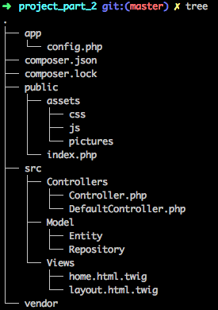
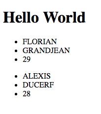

# Mise en place d'une architecture "type" en suivant le design pattern MVC - Part 2

## 1. Creation de l'architecture
1. Créer un dossier app
    1. Dans le dossier app:
        1. Créer config.php
1. Dans le dossier src
    1. Dans le dossier Model
        1. Créer un dossier Entity
        1. Créer un dossier Repository

L'architecture du projet doit maintenant ressembler à ceci:


## 2 Ajouter la configuation de la base de donnée
1. Dans le fichier **config.php**, ajouter les informations nécéssaire à la connexion à votre base de donnée, nous utiliserons ici PDO pour se connecter par la suite, nous avons donc besoin d'un *DSN*, d'un *identifiant* ainsi que d'un *mot de passe*
    ```php
    <?php
    
    // Récupération des valaurs une par une
    $db_name = 'mvcAtelier';
    $db_host = 'localhost';
    $db_port = '3306';
    
    // Définition des constantes, ne pas 
    define('APP_DB_USER', 'root');
    define('APP_DB_PWD', 'root');
    define('DSN', 'mysql:dbname=' . $db_name . ';host=' . $db_host . ':' . $db_port);
    ```
    Si besoin, remplacer les informations db_name, pwd, user, port, host...

2. Importer le fichier dans *index.php*
    1. Les constances seront utilisées dans tout le projet, par conséquent on se doit de les importer depuis notre controlleur frontal
    Modifier la index.php en rajoutant la ligne
        ```php
        require_once '../app/config.php';
        ```
        
## 3. Création de la bdd
Nous utiliserons une bdd simple, une table user avec 3 champs, *name*, *firstname*, et *age*  
Ci dessous le script de création, à executer dans votre shell mysql
```sql
CREATE DATABASE mvcAtelier;

USE mvcAtelier;

CREATE TABLE `user` (
  `id` int(11) NOT NULL PRIMARY KEY AUTO_INCREMENT,
  `name` varchar(255) NOT NULL,
  `firstname` varchar(255) NOT NULL,
  `age` int(11) NOT NULL
) ENGINE=InnoDB DEFAULT CHARSET=utf8;

INSERT INTO `user` (`name`, `firstname`, `age`) VALUES
('GRANDJEAN', 'FLORIAN', '29'),
('DUCERF', 'ALEXIS', '28');
```

## 4. Définition de notre entitée user
1. Dans le dossier Model/Entity, créer un fichier **User.php**, ce dernier va contenir notre class user, elle doit correspondre à notre table user, pour rappel, en POO, une entity, correspondant à une table en base de donnée.
```php
<?php

namespace MyApp\Model\Entity;

/**
 * Class User
 * @package MyApp\Model\Entity
 */
class User{

	/**
	 * @var int
	 */
	private $id;

	/**
	 * @var string
	 */
	private $name;

	/**
	 * @var string
	 */
	private $firstname;

	/**
	 * @var int
	 */
	private $age;
	
	/**
	 * @return int
	 */
	public function getId()
	{
		return $this->id;
	}

	/**
	 * @return string
	 */
	public function getName()
	{
		return $this->name;
	}

	/**
	 * @param string $name
	 */
	public function setName($name)
	{
		$this->name = $name;
	}

	/**
	 * @return string
	 */
	public function getFirstname()
	{
		return $this->firstname;
	}

	/**
	 * @param string $firstname
	 */
	public function setFirstname($firstname)
	{
		$this->firstname = $firstname;
	}

	/**
	 * @return int
	 */
	public function getAge()
	{
		return $this->age;
	}

	/**
	 * @param int $age
	 */
	public function setAge($age)
	{
		$this->age = $age;
	}
}
```
On retrouve bien ici les 4 champs de notre bdd, id, name, firstname et age.

## 5. Configuration PDO via un Manager
De la même façon que pour twig, nous allons définir un Manager pour notre model, une class qui contiendra la configuration  
1. Dans le dossier Model/Repository
    1. Créer une class une fichier **Manager.php**
    2. Dans ce fichier créer une class qui contiendra la configuration de PDO.
```php
<?php

namespace MyApp\Model\Repository;

use PDO;
use PDOException;

/**
 * Class EntityManager
 * @package MyApp\Repository
 */
class Manager
{
	/**
	 * @var PDO
	 */
	protected $db;

	/**
	 * EntityManager constructor.
	 */
	public function __construct()
	{
//		Le "try catch" fonctionne comme une condition classique, dans le try on essaie, si cela fonctionne, on execute, sinon on rentre dans le catch et on renvoie une erreur
		try {
//			Initialisation de PDO en récupérant les constantes défini dans confid.php
			$this->db = new PDO(APP_DSN, APP_DB_USER, APP_DB_PWD);

//			Ajoute d'option permettant une meilleur gestion des erreurs
			$this->db->setAttribute(PDO::ATTR_ERRMODE, PDO::ERRMODE_EXCEPTION);
			
		} catch (PDOException $e) {
			echo 'Connexion échouée : ' . $e->getMessage();
		}
	}
}
```

## 6. Création d'un manager pour notre entity *User*
1. Dans le dossier **Model/Repository**, créer un fichier **UserManager.php**. Ce fichier contiendra toutes les méthodes permettant de requeter sur la table *User* de notre base de donnée.
2. Définir la class **UserManager** qui hérite de la class **Manager**
    ```php
    <?php
    
    namespace MyApp\Model\Repository;
    
    /**
    * Class UserManager
    * @package MyApp\Model\Repository
    */
    class UserManager extends Manager {
       
    }
    ```

3. Définir una première méthode permettant de récupérer toutes les informations de la table User
    ```php
        /**
         * Get all user
         * @return array
         */
        public function getAll(){
    //		Définition de la requete
            $req = $this->db->query('SELECT * FROM user');
            
    //		Traitement et renvoie du résultat
    //		Ici, grâce à PDO, la réponse sera formaté sous forme d'objet de type **User**, d'ou l'intérêt d'avoir une entité User correspondant exactement à la structure de la table User
            return $req->fetchAll(PDO::FETCH_CLASS, User::class);
        }
    ```

4. Le class **UserManager** doit maintenant ressembler à cela:
```php
<?php

namespace MyApp\Model\Repository;

use MyApp\Model\Entity\User;
use PDO;

/**
 * Class UserManager
 * @package MyApp\Model\Repository
 */
class UserManager extends Manager {
	
	/**
	 * Get all user
	 * @return array
	 */
	public function getAll(){
//		Définition de la requete
		$req = $this->db->query('SELECT * FROM user');
		
//		Traitement et renvoie du résultat
//		Ici, grâce à PDO, la réponse sera formaté sous forme d'objet de type **User**, d'ou l'intérêt d'avoir une entité User correspondant exactement à la structure de la table User
		return $req->fetchAll(PDO::FETCH_CLASS, User::class);
	}
}
```

## 7. Récupération des informations depuis notre controller
1. Dans le fichier **DefaultController**, dans le méthode **indexAction()**, nous allons remplacer la définition du tableau User par le résultat de notre base de donnée.
    1. Dans la méthode, supprimer la définition du tableau User
    2. Instancier un nouvel object de type *UserManager*
        ```php
        $userManager = new \MyApp\Model\Repository\UserManager();
        ```
    3. Définir une variable **User** qui stockera le retour de la méthode getAll()
        ```php
        $users = $userManager->getAll();
        ```
    4. La class **DefaultController** doit maintenant ressemble à cela:
        ```php 
        <?php
        
        namespace MyApp\Controllers;
        
        /**
         * Class DefaultController
         * @package MyApp\Controllers
         */
        class DefaultController extends Controller
        {
            public function indexAction(){
                $userManager = new \MyApp\Model\Repository\UserManager();
                $users = $userManager->getAll();
        
                return $this->twig->render('home.html.twig', array(
                    'users' => $users
                ));
            }
        }
        ```
## 8. Raffraichir la page dans le navigateur, les informations de la base de donnée doivent s'afficher

