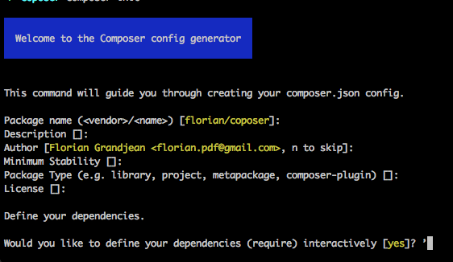

# Process initialisation d'un projet avec composer

### 1. Installation de composer via terminal en Global
```
php -r "copy('https://getcomposer.org/installer', 'composer-setup.php');"  
php -r "if (hash_file('SHA384', 'composer-setup.php') === '544e09ee996cdf60ece3804abc52599c22b1f40f4323403c44d44fdfdd586475ca9813a858088ffbc1f233e9b180f061') { echo 'Installer verified'; } else { echo 'Installer corrupt'; unlink('composer-setup.php'); } echo PHP_EOL;"  
php composer-setup.php  
php -r "unlink('composer-setup.php');"  
mv composer.phar /usr/local/bin/composer  
```
Sources: 
- https://getcomposer.org/download/
- https://getcomposer.org/doc/00-intro.md#globally

### 2. Initialisation du projet avec `composer init`

Source:
- http://www.umanit.fr/En-ce-moment/UmaNotes/Gerer-ses-dependances-PHP-avec-Composer

### 3. Ajout des dépendances du projet (par exemple twig)
Dans le terminal:
```
composer require twig/twig
```
Cette commande met à jour votre *composer.json* et install la dépendance **twig**

### 4. Configuration de notre autoload via composer (composer.json)
Dans le composer.json, ajouter les lignes suivantes:
```
"autoload": {
    "psr-4": {
    	"Acme\\": "src/"
    }
}
```
Remplacer *Acme* par votre namespace global, et eventuellement *src* par le dossier dans lequel se toruvent toutes vos class.
Executer la commande `composer update` afin de mettre à jour composer, commande à effectuer après chaque modification du *composer.json*
Source:
- http://www.umanit.fr/En-ce-moment/UmaNotes/Gerer-ses-dependances-PHP-avec-Composer (section "L'autoloading")

### 5. Configurer Twig (voir doc)
1. Creer une class Controller (il s'agit du controller "manager"), tout vos autres controllers heriteront de cette class afin de profiter de la configuration de twig.
2. Déclarer un attribut en protected (ce dernier sera utilisé par les Controllers enfants)
3. Déclarer **__construct** avec la configuration de twig
4. Si besoin, ajouter d'autres option (debug)
Exemple de configutation type:
```
<?php

namespace Dojo\Controllers;

use Twig_Loader_Filesystem;
use Twig_Environment;
use Twig_Extension_Debug;

/**
 * Class Controller
 * @package Dojo\Controllers
 */
class Controller
{
	/**
	 * @var Twig_Environment
	 */
	protected $twig;

	/**
	 * Controller constructor.
	 */
	public function __construct()
	{
		$loader = new Twig_Loader_Filesystem(__DIR__ . "/../Views/");
		$this->twig = new Twig_Environment($loader, array(
			'cache' => false,
			'debug' => true
		));
		$this->twig->addExtension(new Twig_Extension_Debug());
	}
}
```
Si besoin, remplacer **__DIR__ . "/../Views/"** par l'endroit ou se trouve vos vues.
Source:
- https://twig.symfony.com/doc/2.x/intro.html#installation

### 5. Creer nos différents controller, ces derniers heriteront (extends) de la class mère Controller et nous retournerons une vue
Exemple:
```
<?php

namespace Dojo\Controllers;

/**
 * Class DefaultController
 * @package Dojo\Controllers
 */
class DefaultController extends Controller
{
	/**
	 * @return string
	 */
	public function indexAction(){
		return $this->twig->render('home.html.twig');
	}
}
```

### 6. Créer les vue correspondantes
### 7. Dans notre controller frontal (*public/index.php*), faire un require de l'autoload, et écrire le dispatcher
Exemple:
```
<?php

require '../vendor/autoload.php';

use Dojo\Controllers\DefaultController;

$defaultController = new DefaultController();

if (empty($_GET)){
	echo $defaultController->indexAction();
}
```

### Project exemple
https://github.com/florianpdf/dojo_paris_code