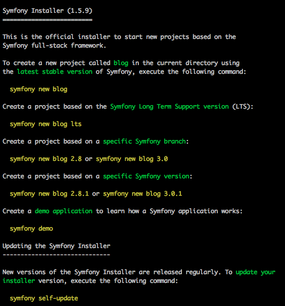

# Process install Symfony // Linux/Mac

### [Documentation officiel](http://symfony.com/doc/current/setup.html)  

##### 1. Executer dans le terminal les lignes suivantes afin de récupérer **Symfony Installer** qui permettra d'initialiser les projets symfony
```
sudo mkdir -p /usr/local/bin  
sudo curl -LsS https://symfony.com/installer -o /usr/local/bin/symfony  
sudo chmod a+x /usr/local/bin/symfony  
```
En savoir plus:
 - [Les variables d'environnement](http://www.commentcamarche.net/faq/3585-bash-la-variable-d-environnement-path)
 - [curl](http://php.net/manual/fr/book.curl.php)  

##### 2. Vérifier que l'installation à fonctionner
```
symfony -v
```
On doit obtenir le résultat ci dessous  

