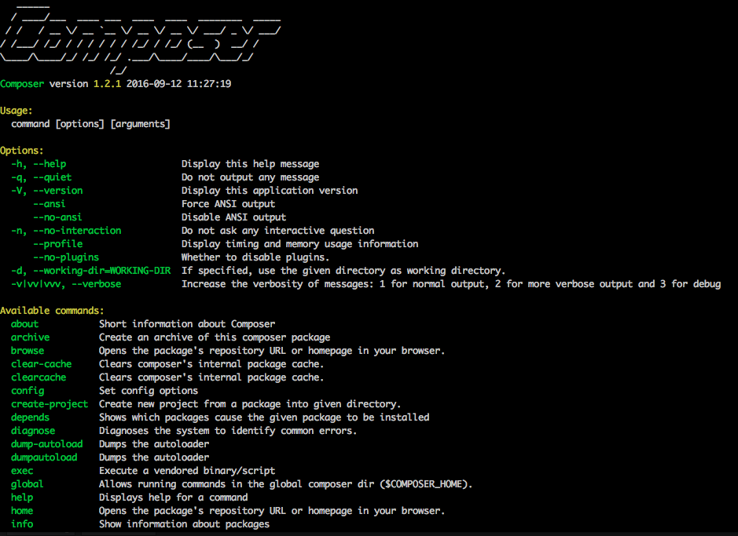

# Process install Composer en global

Composer est le gestionnaire de dépendances par default.  
Attention composer peut s'utiliser en dehors de Symfony.  
[En savoir plus](https://fr.wikipedia.org/wiki/Composer_(logiciel)

### [Documentation officiel](https://getcomposer.org/)

##### 1. Executer dans le terminal les lignes suivantes afin de récupérer **Composer** qui permettra entre autre de gérer les dépendances de Symfony

```
php -r "copy('https://getcomposer.org/installer', 'composer-setup.php');"  
php -r "if (hash_file('SHA384', 'composer-setup.php') === '669656bab3166a7aff8a7506b8cb2d1c292f042046c5a994c43155c0be6190fa0355160742ab2e1c88d40d5be660b410') { echo 'Installer verified'; } else { echo 'Installer corrupt'; unlink('composer-setup.php'); } echo PHP_EOL;"  
php composer-setup.php  
php -r "unlink('composer-setup.php');"  
```

##### 2. Rendre composer disponible sur tout le pc (installation global)
Dans le même dossier que celui utilisé dans l'étape précédente
```
mv composer.phar /usr/local/bin/composer
```

##### 3. Vérifier que l'installation à fonctionner
```
composer -v
```
On doit obtenir le résultat ci dessous

