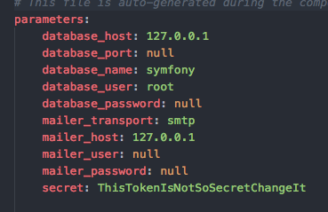

# Créer une nouvelle application Symfony

### [Documentation officiel](http://symfony.com/doc/current/setup.html)

##### 1. Créer une app Symfony (si apache est installer, se rendre dans le dossier émuler par apache, par default sous linux /var/www/html/)
 - Avec la dernière version
```
symfony new my_project_name
```
 - En spécifiant la version (exemple pour la 2.8)
```
symfony new my_project_name 2.8
```

##### 2. Configuration de l'application
Tout ce qui suis représente une partie de la configuration de l'application, et notamment ce qui vous ai propre.
On retrouve ces informations dans le fichier *parameters.yml* situé dans le dossier app/config de l'application.  
  
Sur l'image si dessus:
- **database_host:** adresse du serveur de base de donnée, laissé la valeur par default
- **database_port:** port d'accès à la base de donnée. Sur linux, mettre 3306, sur mac (avec mamp), mettre 8889
- **database_name:** nom de votre base de donnée, par exemple wild_hackathon
- **database_user:** identifiant d'accès à votre base de donnée, par exemple, *root*
- **database_password:** mot de pass d'accès à la base de donnée, par exemple, *root*  

Les paramètres suivants representent la configuration de votre serveur mail, en cas de besoin.
