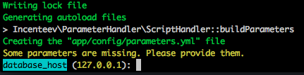
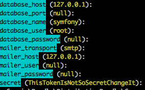

# Récupérer une application Symfony existante sur un dépot Github

### [Documentation officiel](http://symfony.com/doc/current/setup.html)

##### 1. Git clone project
- RDV dans le dossier émuler par apache.
- ```git clone hurl_dépot_github```
- Se déplacer dans le dossier créé

##### 2. Installer les dépendances du projet
- Executer la commande ```composer install```

La dernière commande à pour effet d'installer toutes les dépendances requisent par le projet, c'est dernière sont listées dans le fichier *composer.json* situé à la racine du projet.

Une fois les dépendances installer, on doit obtenir l'image ci dessous:  


##### 3. Configuration de l'application
Tout ce qui suis représente une partie de la configuration de l'application, et notamment ce qui vous ai propre.
On retrouve ces informations dans le fichier *parameters.yml* situé dans le dossier app/config de l'application.  
Sur l'image ci dessus, database_host correspond à la propriété à modifier, 127.0.0.1, correspond à la valeur par défault.  
Si on fait enter, l'adresse d'accès au serveur de base de donné sera 127.0.0.1.  

##### 4. Explication des parametres

- **database_host:** adresse du serveur de base de donnée, laissé la valeur par default
- **database_port:** port d'accès à la base de donnée. Sur linux, mettre 3306, sur mac (avec mamp), mettre 8889
- **database_name:** nom de votre base de donnée, par exemple wild_hackathon
- **database_user:** identifiant d'accès à votre base de donnée, par exemple, *root*
- **database_password:** mot de pass d'accès à la base de donnée, par exemple, *root*  

Les paramètres suivants representent la configuration de votre serveur mail, en cas de besoin.
