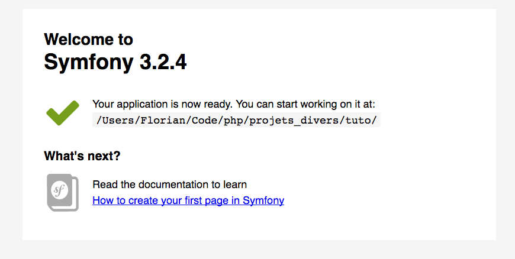

# Ouvrir l'application dans votre navigateur

Une fois l'installation faites, l'application est accessible via le navigateur.
Pour cela rendez dans le dossier web de l'application.  
Exemple: ```http://localhost/my_project_name/web/```

Symfony offre plusieurs environnement de travail:
- Environnement de developpement, qui va offrir une gestion d'erreur approfondi
- Environnement de producation, qui va afficher le site tel qu'il sera une fois mis en ligne
- Environnement de test, environnement plutot "abstrait" qui nous permettra de gérer nos tests.

L'environnement de production est accessible via le fichier **app.php**.  
L'environnement de developpement est accessible via **app_dev.php**.  
Pendant le developpement de notre application, on travaillera essentiellement via **app_dev.php** afin d'évoluer grâce à des erreurs explicite.  
Une fois la page ouverte, on devrait obtenir ceci:  



## Félicitation
