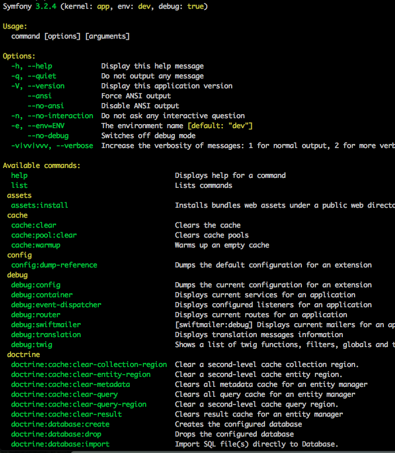
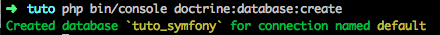

# Premier pas avec la console Symfony

##### 1. Comment ?
La console symfony est disponible est tapant `php bin/console` (pour une version 3.* de Symfony).  
Elle va nous permettre de communique simplement avec notre application et d'effectuer des actions automatiquement.
Si on tape une fois dans le dossier de son projet `php bin/console`, on obtient:  
  
C'est la liste de toutes les commandes misent à disposition par Symfony

##### 2. Generate database
###### Avant...
Pour créer une base de donnée, avant c'etait comme ça:
```
mysql -u user_bdd -p
CREATE DATABASE wild_hackathon
```
###### Avec Symfony...
Une fois le fichier parameters complété... (voir [3_create_app.md](3_create_app.md))
```
php bin/console doctrine:database:create
```
On obtient:  

#### La base de donnée a été créé avec succès, félicitation

##### 3. Doctrine
Doctrine est un ORM (Oriented Query Langage), et est notamment l'ORM par défaut de Symfony.
Un ORM permet une communication simplifier avec notre base de donnée.
### [Documentation officiel Doctrine](http://www.doctrine-project.org/projects/orm.html)  
